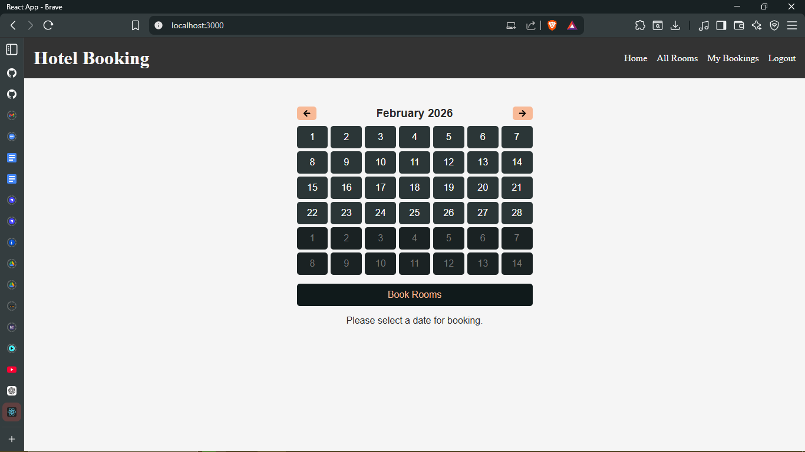
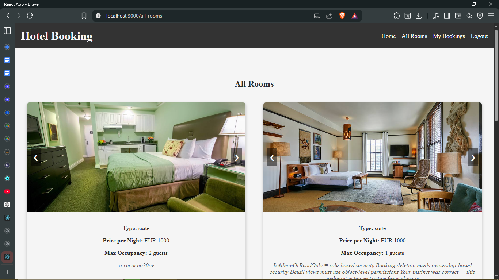
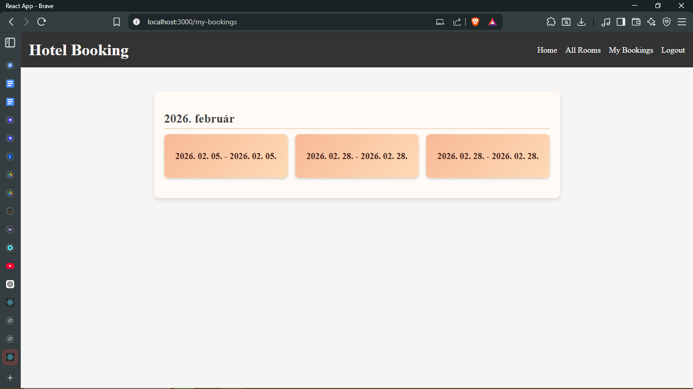
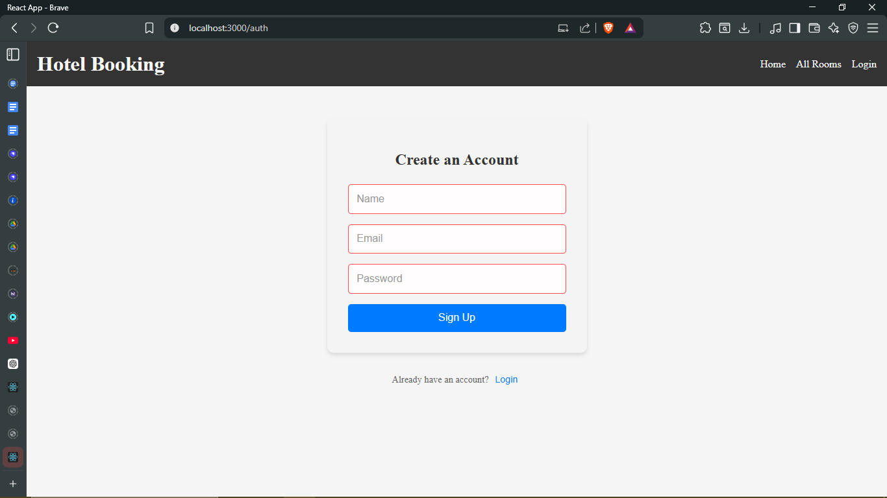
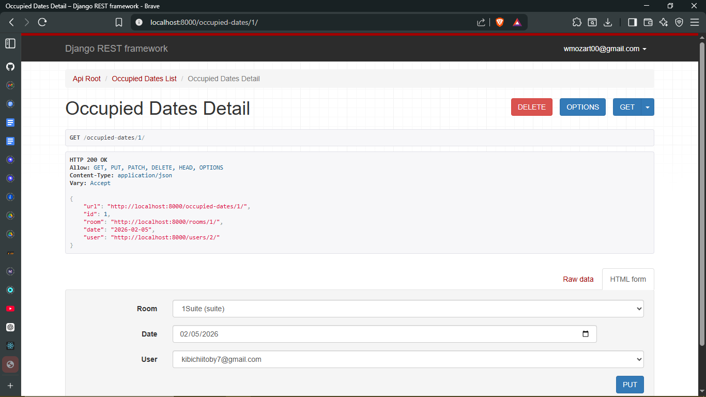
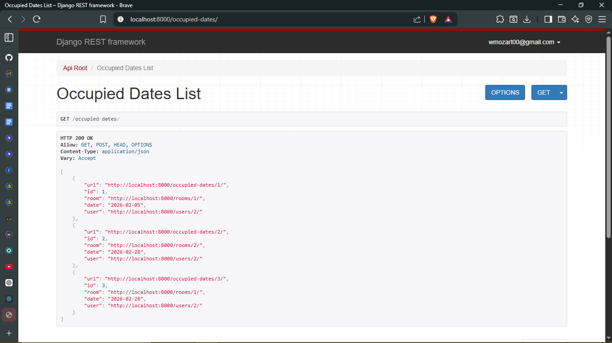
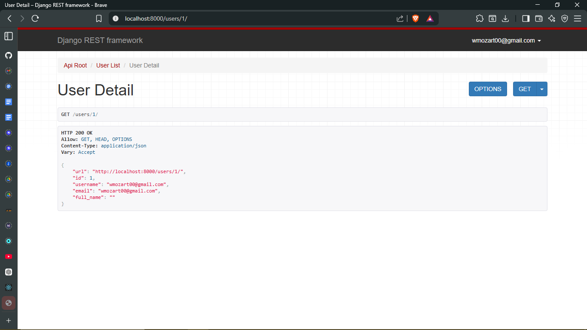
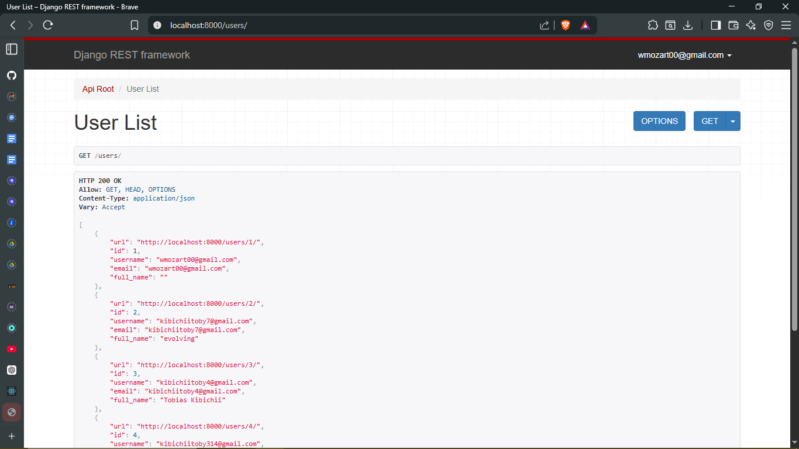

<!DOCTYPE html>
<html lang="en">
<body>
    <h3>
⚠️ **Notice:** This repository primarily focuses on the Django backend API for the Room Booking system.  
While a React frontend exists in the project, it is included for demonstration purposes and is not the main focus of this repository.
    </h3>

<h3>
<a href="https://docs.google.com/document/d/1gr9pQSLCrEecp1FakGXY1fuMfVXCMaPGPETjS8B-DDQ/edit?usp=sharing">Documentaion Link</a>
</h3>
    
<h2>🏨 Room Booking API</h2>

    The <strong>Room Booking API</strong> is a Django REST Framework-based backend system
    for managing room reservations. It allows users to view available rooms, book rooms,
    manage their bookings, and interact with the system through secure API endpoints. 🛏️

<h3>1. 📌 Project Overview</h3>

    This API is designed to handle room bookings in a structured, scalable manner.
    It includes models for <strong>Rooms</strong>, <strong>Users</strong>, <strong>Occupied Dates</strong>,
    and <strong>Room Images</strong>. The API supports authentication, authorization,
    and role-based access control to separate regular users and administrators. 🧑‍💻

<h3>2. 💻 System Requirements</h3>
<ul>
    <li>🐍 Python 3.10+</li>
    <li>🕸️ Django 6.0+</li>
    <li>🧩 Django REST Framework</li>
    <li>🗄️ SQLite (default) or another relational database</li>
    <li>🔧 Optional: Postman or any API testing client</li>
</ul>

<h3>3. ⚙️ Installation & Setup</h3>
<ol>
    <li>Clone the repository:  
    <pre><code>git clone https://github.com/yourusername/room-booking-api.git</code></pre></li>

    <li>Navigate to the project folder:  
    <pre><code>cd room-booking-api</code></pre></li>

    <li>Create and activate a virtual environment:  
    <pre><code>python -m venv venv
source venv/bin/activate  # Linux/Mac
venv\Scripts\activate     # Windows</code></pre></li>

    <li>Install dependencies:  
    <pre><code>pip install -r requirements.txt</code></pre></li>

    <li>Apply database migrations:  
    <pre><code>python manage.py migrate</code></pre></li>

    <li>Create a superuser for admin access:  
    <pre><code>python manage.py createsuperuser</code></pre></li>

    <li>Run the development server:  
    <pre><code>python manage.py runserver</code></pre></li>
</ol>

<h3>4. 📂 Models</h3>

    The application contains the following main models:

<ul>
    <li>🏢 <strong>Room:</strong> Represents hotel rooms. Contains type, price, occupancy, and description.</li>
    <li>🖼️ <strong>RoomImage:</strong> Stores images related to rooms with optional captions.</li>
    <li>📅 <strong>OccupiedDate:</strong> Tracks which user has booked which room on which date, enforcing uniqueness to prevent double bookings.</li>
    <li>👤 <strong>User:</strong> Custom user model based on email authentication with a full_name field.</li>
</ul>

<h3>5. 🛠️ Serializers</h3>

    Serializers convert model instances into JSON data for API responses and validate incoming data:

<ul>
    <li>📦 <strong>RoomSerializer:</strong> Includes room details, related images, and occupied dates.</li>
    <li>📅 <strong>OccupiedDateSerializer:</strong> Manages bookings, linking users and rooms.</li>
    <li>🖼️ <strong>RoomImageSerializer:</strong> Handles room images and captions.</li>
    <li>👤 <strong>UserSerializer:</strong> Handles user creation, including password hashing and validation.</li>
</ul>

<h3>6. 📝 Views & API Endpoints</h3>

    The API uses Django REST Framework views to manage endpoints:

<ul>
    <li>🛏️ <strong>RoomList & RoomDetail:</strong> Admin-only views for creating, updating, and deleting rooms.</li>
    <li>📅 <strong>OccupiedDatesList & OccupiedDatesDetail:</strong> Manage bookings; users see only their bookings, while staff can access all.</li>
    <li>👤 <strong>UserList & UserDetail:</strong> Expose user data with permission checks.</li>
    <li>🔑 <strong>Register & Login:</strong> Handle user registration and token-based authentication.</li>
</ul>

<h3>7. 🔐 Authentication & Permissions</h3>
<ul>
    <li>✉️ Custom <code>EmailBackend</code> allows login via email instead of username.</li>
    <li>🔑 Token-based authentication for API access.</li>
    <li>🛡️ Permissions control access:
        <ul>
            <li>📝 <code>IsOwnerOrReadOnly</code> ensures users can modify only their own bookings.</li>
            <li>👑 <code>IsAdminOrReadOnly</code> allows admins full control while others can only read.</li>
        </ul>
    </li>
</ul>

<h3>8. 🌐 URL Routing</h3>

    URL paths follow REST conventions:

<ul>
    <li><code>/rooms/</code> - List and create rooms</li>
    <li><code>/rooms/&lt;id&gt;/</code> - Retrieve, update, delete a room</li>
    <li><code>/occupied-dates/</code> - List and create bookings</li>
    <li><code>/occupied-dates/&lt;id&gt;/</code> - Manage a specific booking</li>
    <li><code>/users/</code> - List users (admin-only)</li>
    <li><code>/users/&lt;id&gt;/</code> - Retrieve user profile</li>
    <li><code>/login/</code> - Obtain token via credentials</li>
    <li><code>/register/</code> - Create new user and token</li>
</ul>

<h3>9. Minimal Working Example – Single Room Model 🏨</h3>

This example demonstrates:

<ul>
  <li>Creating and listing rooms.</li>
  <li>Viewing details of a specific room.</li>
  <li>How the Room model fields are represented in the API.</li>
  <li>Basic URL navigation.</li>
</ul>

<h3>models.py</h3>
<pre><code class="language-python">
from django.db import models

# Room model represents a hotel or rental room
class Room(models.Model):
    ROOM_TYPES = [
        ('suite', 'Suite'),
        ('standard', 'Standard Room'),
        ('deluxe', 'Deluxe Room')
    ]
    
    # Fields for the room
    name = models.CharField(max_length=100, blank=True, default='')   # Room name
    type = models.CharField(max_length=100, choices=ROOM_TYPES)       # Type of room
    pricePerNight = models.IntegerField(default=150)                  # Price per night in default currency
    maxOccupancy = models.IntegerField(default=1)                     # Maximum number of guests
    description = models.TextField(default='')                        # Room description
    
    def __str__(self):
        return f"{self.name} ({self.type})"
</code></pre>

<h3>serializers.py</h3>
<pre><code class="language-python">
from rest_framework import serializers
from .models import Room

# Serializer converts Room model to JSON and vice versa
class RoomSerializer(serializers.ModelSerializer):
    class Meta:
        model = Room
        # Include all main fields
        fields = ['id', 'name', 'type', 'pricePerNight', 'maxOccupancy', 'description']
</code></pre>

<h3>views.py</h3>
<pre><code class="language-python">
from rest_framework import generics
from .models import Room
from .serializers import RoomSerializer

# List all rooms or create a new room
class RoomList(generics.ListCreateAPIView):
    queryset = Room.objects.all()         # Get all Room objects
    serializer_class = RoomSerializer     # Use the RoomSerializer

# Retrieve, update, or delete a specific room
class RoomDetail(generics.RetrieveUpdateDestroyAPIView):
    queryset = Room.objects.all()         # Get all Room objects
    serializer_class = RoomSerializer     # Use the RoomSerializer
</code></pre>

<h3>urls.py</h3>
<pre><code class="language-python">
from django.urls import path
from . import views

urlpatterns = [
    path('rooms/', views.RoomList.as_view(), name='room-list'),          # List or create rooms
    path('rooms/&lt;int:pk&gt;/', views.RoomDetail.as_view(), name='room-detail')  # View, update, or delete a specific room
]
</code></pre>

<h3>Example Outputs</h3>

<h4>1. GET <code>/rooms/</code> – List All Rooms</h4>
<pre><code class="language-json">
[
  {
    "id": 1,
    "name": "Ocean View Suite",
    "type": "suite",
    "pricePerNight": 200,
    "maxOccupancy": 2,
    "description": "A beautiful suite with an ocean view and king-size bed."
  },
  {
    "id": 2,
    "name": "Standard Room",
    "type": "standard",
    "pricePerNight": 100,
    "maxOccupancy": 1,
    "description": "A cozy room for solo travelers."
  }
]
</code></pre>

<h4>2. GET <code>/rooms/1/</code> – View Room Details</h4>
<pre><code class="language-json">
{
  "id": 1,
  "name": "Ocean View Suite",
  "type": "suite",
  "pricePerNight": 200,
  "maxOccupancy": 2,
  "description": "A beautiful suite with an ocean view and king-size bed."
}
</code></pre>

<h4>3. POST <code>/rooms/</code> – Create a New Room</h4>

<strong>Request Body:</strong>

<pre><code class="language-json">
{
  "name": "Deluxe Room",
  "type": "deluxe",
  "pricePerNight": 180,
  "maxOccupancy": 2,
  "description": "Spacious room with modern amenities."
}
</code></pre>

<strong>Response:</strong>

<pre><code class="language-json">
{
  "id": 3,
  "name": "Deluxe Room",
  "type": "deluxe",
  "pricePerNight": 180,
  "maxOccupancy": 2,
  "description": "Spacious room with modern amenities."
}
</code></pre>

<h3>10. 🧪 Testing & Error Handling</h3>
<ul>
    <li>⚠️ API endpoints handle invalid requests gracefully using DRF exceptions.</li>
    <li>🔒 Permissions and ownership checks prevent unauthorized access.</li>
    <li>📅 Edge cases like double bookings or exceeding max occupancy are validated at the model and serializer level.</li>
    <li>📝 Logs and responses provide clear error messages to clients.</li>
</ul>

<h3>11. 💡 Reflections & Learning</h3>

    Building this API highlighted key Django and REST concepts:

<ul>
    <li>🛠️ Understanding the ORM and model relationships is crucial for reliable data handling.</li>
    <li>🔄 Serializers act as a bridge between models and API clients, enabling validation and nested data management.</li>
    <li>🛣️ Views and URL routing enforce clean API architecture and permission logic.</li>
    <li>🔑 Authentication and token-based security are essential for protecting user data.</li>
</ul>

<h3>12. 🚀 Future Enhancements</h3>
<ul>
    <li>🔍 Add search and filtering for rooms by type, price, or availability.</li>
    <li>📆 Integrate calendar views for bookings.</li>
    <li>✉️ Add email notifications for booking confirmations.</li>
    <li>🛡️ Implement rate limiting and advanced security measures for production.</li>
</ul>

<h3>13. AI Prompt Journal</h3>
<h3>
In <a href="https://docs.google.com/document/d/1gr9pQSLCrEecp1FakGXY1fuMfVXCMaPGPETjS8B-DDQ/edit?usp=sharing">Documentation</a>

</h3>

<strong>🖼️ Screenshots</strong>

   
Home Page 

  
   
Book A Room Page 

  
   
All Rooms Page

  
   
My Bookings Page

  
   
Register/Login Page

  
   
Url Output Example(Occupied_dates_detail)

  
   
Url Output Example(Occupied_dates_list)

  
   
Url Output Example(User_detail)

  
   
Url Output Example(User_list)

  
   

<strong>Author:</strong> Tobias Kibichii

</body>
</html>
